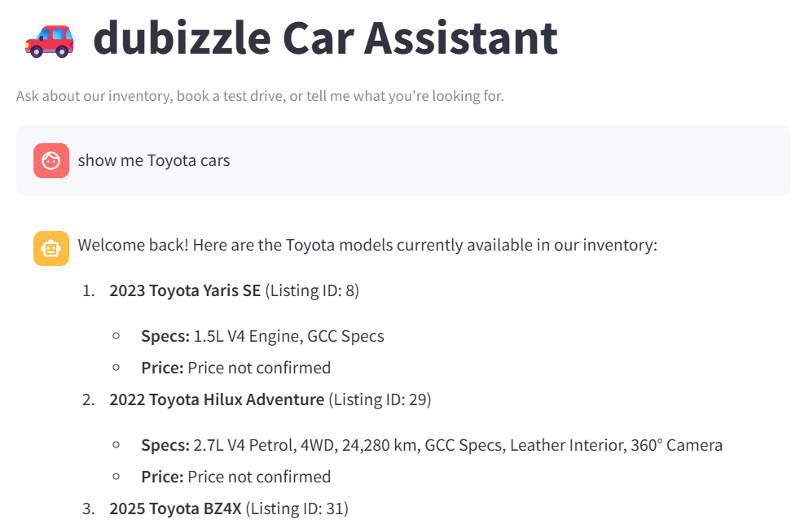
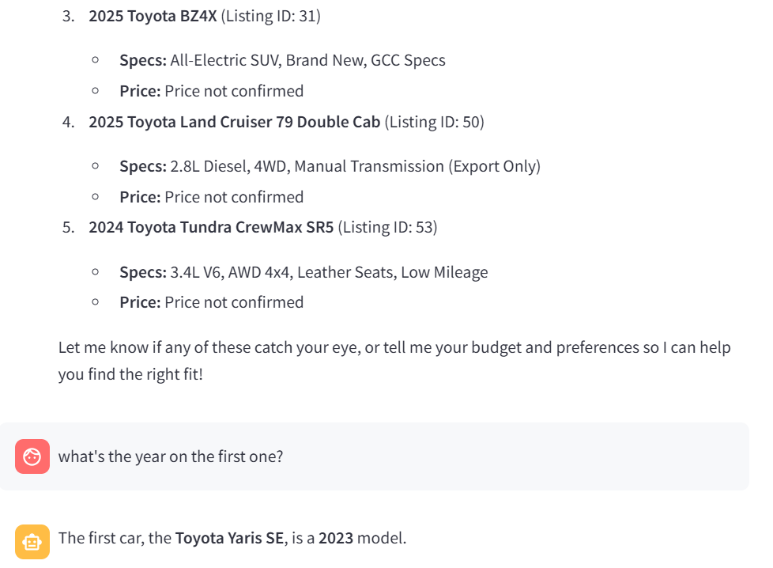
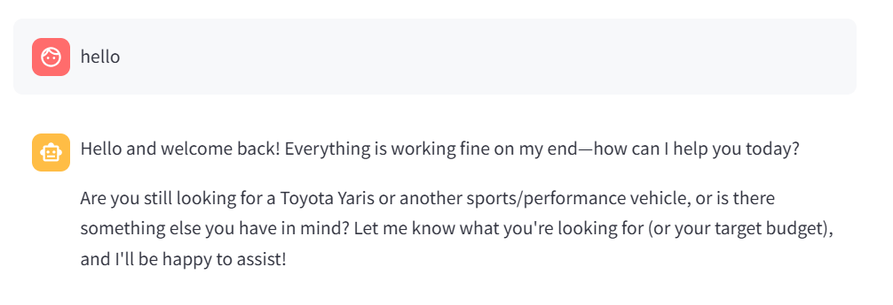

# dubizzle Car Assistant — Prototype

An AI assistant for exploring a used-car inventory: search cars, book a
simulated test drive, get qualified as a lead, and have the assistant
remember you both within a conversation and across visits.


<!--Built for the dubizzle ML Intern Take-Home Assessment 2026 -->

## Architecture

```
Streamlit client  --HTTP-->  FastAPI backend
                                ├── Orchestrator (system prompt, guardrails, tool-calling loop)
                                ├── Retrieval tool (structured pandas filter + Chroma hybrid RAG)
                                ├── Booking / lead-capture tools
                                └── Persistence (SQLite: short-term + long-term memory; CSV: leads)
                                        │
                                        v
                              Gemini (via LiteLLM)
```

The client never calls the LLM or touches the dataset directly - it only
talks to the FastAPI backend over HTTP. All grounding, memory, and
guardrail logic lives server-side.

## Setup

1. **Install [uv](https://docs.astral.sh/uv/)** if you don't have it:
   ```bash
   curl -LsSf https://astral.sh/uv/install.sh | sh
   ```
2. **Get a free Gemini API key** at https://aistudio.google.com/apikey
3. **Configure your environment**:
   ```bash
   cp .env.example .env
   # edit .env and paste your real key in place of "your_key_here"
   ```
4. **Install dependencies**:
   ```bash
   uv sync --group dev --group client
   ```
5. **Run the backend** (terminal 1):
   ```bash
   uv run uvicorn main:app --reload
   ```
   Check `http://localhost:8000/health` - it should report
   `listings_loaded: 100` and `hybrid_search_available: true`.
6. **Run the client** (terminal 2, from the same project folder):
   ```bash
   uv run streamlit run client/app.py
   ```

### Running tests and the eval script

```bash
uv run pytest                        # unit tests - deterministic logic, no LLM calls
uv run python scripts/eval_queries.py  # live eval - requires the backend running (step 5)
```

## Why these choices

**Client: Streamlit.** Chosen over a notebook for a real chat UI and
easier demo screenshots. Its default rerun-the-whole-script model is
why session state (`st.session_state`) is used carefully - only for
UI-local concerns (message history for rendering, the current
`session_id`), never as the system of record; the backend's SQLite
database is the actual source of truth for both memory tiers.

**Retrieval: hybrid RAG**, not pure semantic search or plain SQL/tool-calling.
A structured pandas pre-filter (make/model/year/price) narrows the
candidate set first - this keeps exact filters exact and fully
predictable/debuggable. A Chroma vector search over listing
descriptions then ranks the *fuzzy* part of a query ("family-friendly",
"good for road trips") within that narrowed pool. Pure semantic search
alone was rejected as an anti-pattern here: it would throw away
perfectly good structured fields (year, make, price) and hope
embedding similarity recovers exact constraints, which it won't
reliably do. Text-to-SQL was also considered and rejected - it's a
known failure-prone pattern (LLMs generate subtly wrong SQL) and is
overkill for a single 7-column table with no joins.

**Memory: SQLite for both tiers.** Short-term (per-session message
history) and long-term (per-user preferences) live in the same SQLite
database, in separate tables, rather than splitting short-term into an
in-process dict. This gives one persistence story instead of two, and
survives an accidental backend restart mid-demo. Leads are written to
a separate CSV file, per the assessment's explicit requirement.

**The price problem.** The dataset has no structured price column -
only free-text `title`/`description`, in wildly inconsistent formats
(`"AED 115,750.00 in cash"` vs `"1,430AED / Month"` vs `"AED 89 900"`).
A tiered-confidence extractor (`app/data/loader.py`) computed once at
load time assigns each listing `high` (explicit cash price stated),
`medium` (best-guess from a non-monthly AED figure), or `none`. Of the
100 listings, only 22 have an extractable price (3 high, 19 medium) -
the other 78 genuinely have none. The assistant is explicitly
instructed to say so honestly when filtering by price rather than
silently dropping or inventing figures for those listings.

## Known limitations

- **No real authentication.** The "returning user" identity is a UUID
  written to a local file by the Streamlit client, which identifies
  *the machine running the client*, not a browser, device, or logged-in
  account. A different machine looks like a new user. Fine for a local
  single-user prototype; a real product needs actual auth.
- **Bookings are fully simulated.** There's no real calendar and no
  double-booking prevention - `book_viewing` only validates the
  day/hour window (Mon-Sat, 8am-8pm).
- **Guardrails are prompt + a small keyword list**, not a dedicated
  classifier. Sufficient for this scope; a production system would
  likely add a lightweight moderation/classification pass.
- **In-process Chroma, no connection pooling, single FastAPI process.**
  Fine at ~100 listings and a single concurrent user; would need a real
  vector DB, pooled connections, and horizontal scaling at production
  traffic levels.
- **~78% of listings have no confirmed price**, inherent to the source
  data, not a bug - see "The price problem" above.
- **No CI pipeline, no full observability stack (tracing/dashboards)** -
  deliberately out of scope for a take-home prototype; basic structured
  logging exists (see `main.py`, `app/retry.py`).
- **Free-tier Gemini rate limits.** The AI Studio free tier caps requests
  per minute (RPM), tokens per minute (TPM), and requests per day (RPD)
  per project. Heavy local testing (e.g. running `eval_queries.py`
  repeatedly) can trip these and produce a temporary `429`. RPM/TPM
  windows clear within about a minute; RPD resets at midnight Pacific.
  This isn't a bug in the app - it's inherent to running on a free key,
  and a paid tier or `LiteLLM`'s built-in model fallback (see "Future
  improvements") would remove it in production.
## Future improvements

- Real authentication instead of a locally-persisted machine ID.
- A proper vector database and connection pooling for real scale.
- Automatic model fallback (LiteLLM supports this natively) if the
  primary Gemini model is under sustained high demand.
- A dedicated guardrail classifier instead of a keyword list.
- Multi-language handling for the Arabic-language listings in the dataset.

## Screenshots


1. A multi-turn conversation showing short-term memory 
  

2. Cross-session recall: close and reopen the client (same machine),
   and show the assistant referencing a preference from the earlier
   session.


